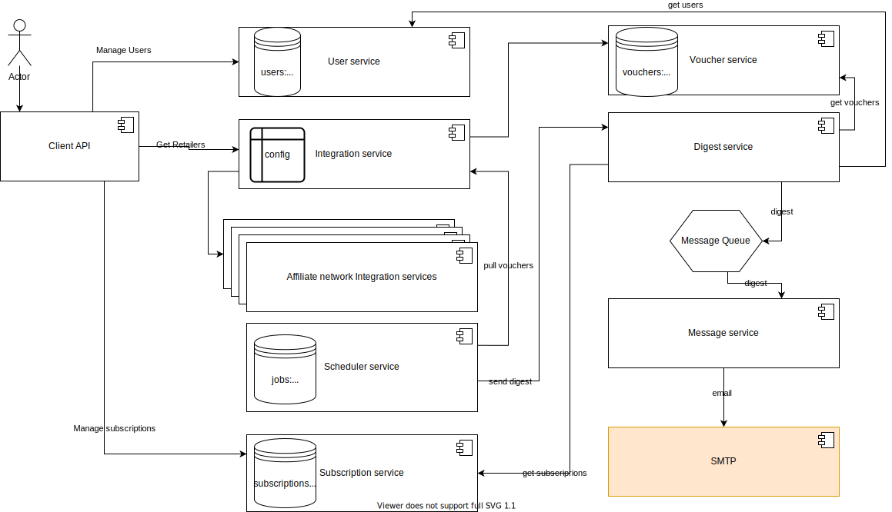
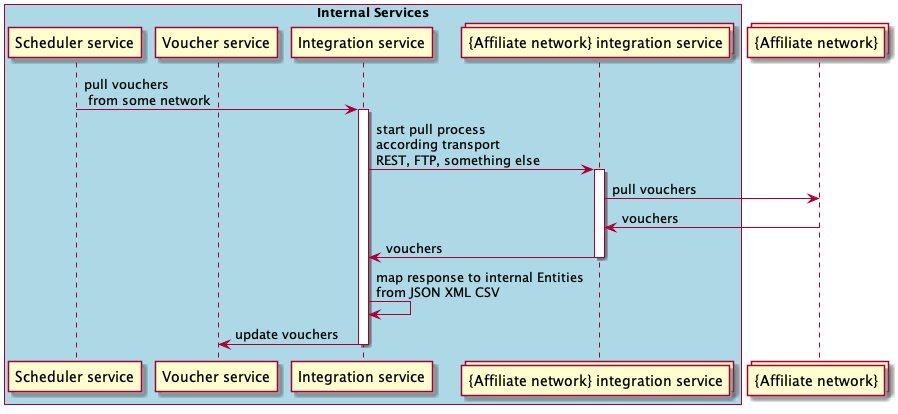
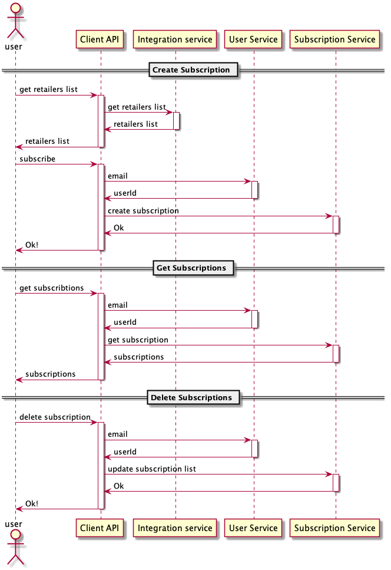
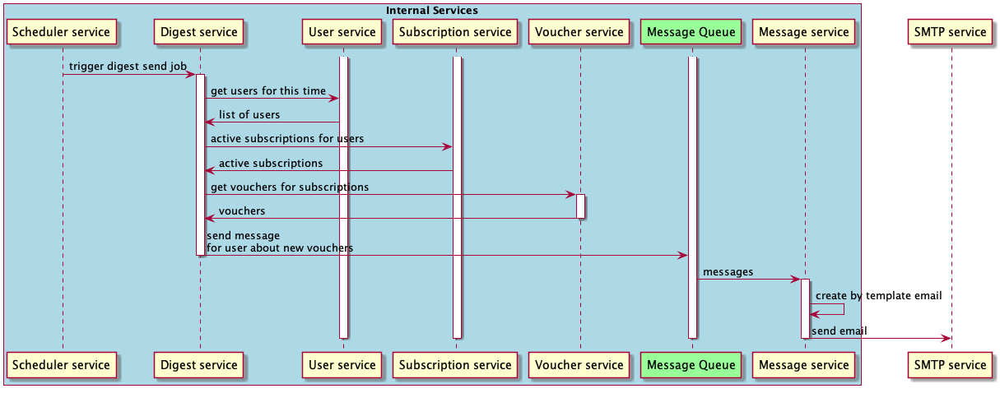

# High-level architecture diagram of Voucher Alert System

### Overview 

The system provides next functionality: 
 - collects vouchers from affiliated networks.
 - manage subscription lists for users
 - send a digest with vouchers to users according to users subscriptions 
 

#### High level view
 
The system contains next services:
 - Client API (Gateway)
 - Voucher service
 - User service
 - Integration service
 - Subscription service
 - Digest service
 - Message service
 - Collection of Affiliate network integration services (based on a protocol of integration)
 - Message queue (RabbitMQ, Kafka)
 

- ### User service
    #### Data storages:
     - RDS
     
     Tables:
     
     |Users    |
     |---      |
     |userId   |
     |email    |
     |timezone |
     
    #### Communication between components
     - REST API for CRUD operations

- ### Voucher service
    #### Data storages:
     - RDS
     
     Tables:
     
     |Vouchers  |
     |---       |
     |voucherId |
     |retailer  |
     |ttl       |
     |payload   |
     
    #### Communication between components
     - REST API

- ### Subscription service
    #### Data storages:
     - RDS
     
     Tables:
     
     |Subscriptions |
     |---           |
     |userId        |
     |retailer      |
     
    #### Communication between components
     - REST API
     
- ### Digest service
    #### Communication between components
     - REST API
     - Produce message to messages queue

- ### Message service
    #### Scope
    - build email message by predefined templates
    #### Communication between components
     - consume message from messages queue
     - depends on SMTP server
     
- ### Integration service
    #### Scope
    - route requests to Affiliate network
    - converting third party formats to internal
    
    #### Data storages:
     - Configurations service
     - properties files
     
    #### Communication between components
     - REST API
       

### Service Flows
#### Pull vouchers flow

#### Subscriptions flow

#### Sends digest flow

